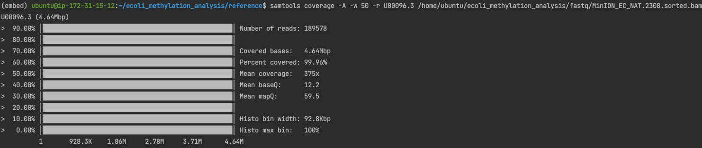

## Ecoli analysis
PLAN: Download Fast5 files, call with Megalodon, use megalodon calls to label positions

* Data from `https://www.nature.com/articles/s41592-021-01109-3`
* Raw Fast5 data `https://sra-download.ncbi.nlm.nih.gov/traces/sra59/SRZ/010032/SRR10032546/MinION_EC_NAT.tar.gz`

* Download data
```
wget https://sra-download.ncbi.nlm.nih.gov/traces/sra59/SRZ/010032/SRR10032546/MinION_EC_NAT.tar.gz
tar -xzf MinION_EC_NAT.tar.gz
# reference from https://www.ncbi.nlm.nih.gov/nuccore/U00096

nanopolish extract /home/ubuntu/ecoli_methylation_analysis/MinION_EC_NAT --recurse --fastq --output /home/ubuntu/ecoli_methylation_analysis/fastq/MinION_EC_NAT.fastq
minimap2 --MD -t 18 -ax map-ont /home/ubuntu/ecoli_methylation_analysis/reference/ecoli.fa /home/ubuntu/ecoli_methylation_analysis/fastq/MinION_EC_NAT.fastq | samtools view -@ 10 -bS - | samtools sort -@ 10 - > /home/ubuntu/ecoli_methylation_analysis/fastq/MinION_EC_NAT.sorted.bam && samtools view -@ 40 -bSF 2308 /home/ubuntu/ecoli_methylation_analysis/fastq/MinION_EC_NAT.sorted.bam > /home/ubuntu/ecoli_methylation_analysis/fastq/MinION_EC_NAT.2308.sorted.bam && samtools index /home/ubuntu/ecoli_methylation_analysis/fastq/MinION_EC_NAT.2308.sorted.bam
samtools coverage -A -w 50 -r U00096.3 /home/ubuntu/ecoli_methylation_analysis/fastq/MinION_EC_NAT.2308.sorted.bam
# remove_sa_analyses -d /home/ubuntu/ecoli_methylation_analysis/MinION_EC_NAT --analysis --threads 18
```


* Run megalodon as our labels
```
# megalodon on p3.2xlarge
megalodon /home/ubuntu/ecoli_methylation_analysis/MinION_EC_NAT \
--outputs mod_mappings mods \
--reference /home/ubuntu/ecoli_methylation_analysis/reference/ecoli.fa \
--processes 8 --overwrite --guppy-server-path guppy_basecall_server \
--output-directory /home/ubuntu/ecoli_methylation_analysis/output \
--guppy-timeout 1000 --guppy-params "--device cuda:0"
```

* Position Filtering

```
import pandas as pd
import os

N = 20
megalodon = "/home/ubuntu/ecoli_methylation_analysis/output/modified_bases.5mC.bed"
BED_PATHS = "/home/ubuntu/ecoli_methylation_analysis/subset_reference/bed_files"
OUTPUT_DIR = "/home/ubuntu/ecoli_methylation_analysis/subset_reference/positions_files"
top_n_dir = "/home/ubuntu/ecoli_methylation_analysis/subset_reference/filtered_positions"

possible_mods = pd.read_csv(megalodon,
                       names=["Chromosome", "start", "stop", "name", "score", "Strand", "start2", "end2", "color",
                              "coverage", "percentage"],
                       sep="\t",
                       usecols=["Chromosome", "start", "Strand", "coverage", "percentage"])
percents = [0, 10, 20, 30, 40, 50, 60, 70, 80, 90, 100]


possible_mods['find'] = "C"
possible_mods['replace'] = "M"
possible_mods['ambig'] = "Y"
possible_mods = possible_mods[possible_mods["start"] < 100000]
for x in percents:
    output_path = os.path.join(BED_PATHS, f"filtered_chr1_{x}.bed")
    temp_mods = possible_mods[(possible_mods["percentage"] > x-1) & (possible_mods["percentage"] < x+1)]
    temp_mods.to_csv(output_path, sep="\t", index=False)
    output_path = os.path.join(OUTPUT_DIR, f"filtered_{x}_variant.positions")
    temp_mods.to_csv(output_path, sep="\t", index=False,
                     columns=["Chromosome", "start", "Strand", "find", "ambig"], header=False)
    sample_number = len(temp_mods)
    if N < len(temp_mods):
        sample_number = N 
    sample = temp_mods.sample(sample_number)
    output_path = os.path.join(top_n_dir, f"top_{N}_covered_filtered_{x}.positions")
    sample.to_csv(output_path, sep="\t", index=False,
                     columns=["Chromosome", "start", "Strand", "find", "ambig"], header=False)

```

* Prep data for S3 / kubernetes
`bash prep_data.sh`

* Run K8 job
`make ecoli`